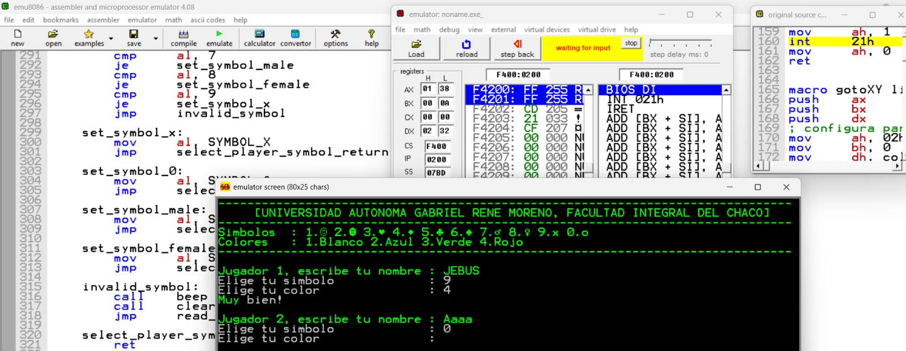
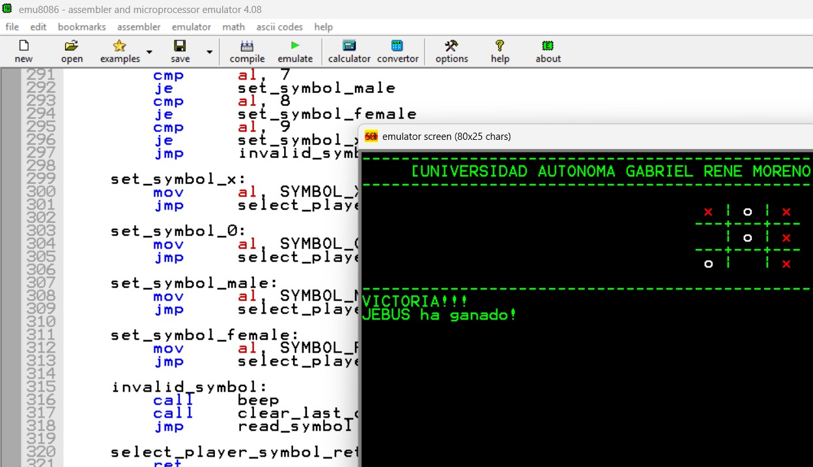

# Programacion Ensamblador *(INF-221)*

Programas utilizados:
> MSX88

> Emulador 8086

Los temas vistos en esta materia fueron 
- chipSet
- tarjeta madre y componentes
- chipset tarjeta madre y puertos
- emulador 8086
- arquitectura von neumann

- codigo ASCII
- interrupciones en el simulador MSX88

  (falto mucha mas practica)

### proyectos ejecutado(interfaz 1) realizados el 2024

### proyecto ejecutado (interfaz 2 resultado)

